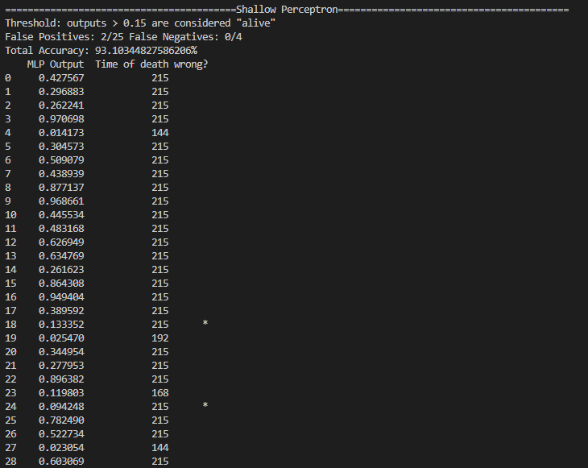
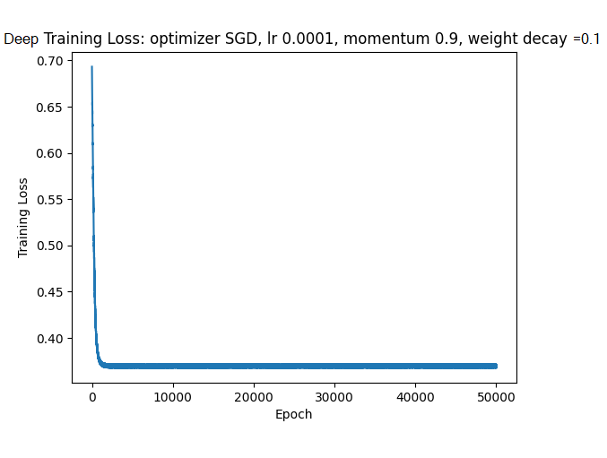
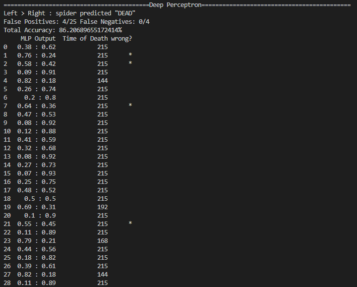

# How Can We Tell if a Spider Has Died?

@ Author [Jack Bosco](https://GitHub.com/JackBosco)

### Check out the idea pitch for a basic outline to the problem. 

### What I have are three .csv files where spider activity is tallied at each minute (row). The time of individual spider deaths  was provided by combined decision of two circadian expert. I can use that to __train__ the models.

### I want to try three different approaches here:

1. A simple multilayered perceptron (MLP) with nothing but NumPy

2. A more complicated and powerful MLP model with PyTorch

3. Something called an LSTM. I will cross that bridge when I get to it

### But before I can do any of that, I need to somehow parse and __compress__ this data to make it learnable.

* First, define a *target* output for each spider by saving the row where it died
  * this is what makes the data useable for training the models
* Then pad all empty rows with 0s so the training data *looks like* the testing data
* Lastly, the dataset might be too large to train without using something like Amazon Web Services
  * I can crunch the thousands of rows in the files to a few hundred to make the input and output spaces less complex
    * This means converting minutes to hours or even days
  * I then flatten the data to 0s and 1s (0 for no activity, 1 for more than no activity) in each interval, again for complexity

-----

## Using a simple MLP Classifier

It took 20000 epochs to train this simple classifier. That may sound like a lot, but training it took less than a minute because the model is *shallow*. Shallow as in it only has five hidden units. When the loss starts to asymptote this means we have a working training algorithm.

Somehow I managed to get ~93% accuracy with this sigmoidal, shallow algorithm. These results are much higher than expected. 
The difference between this AI model's results and the __deep__ model is likely due to pure luck. 
Since every parameter in the model is originially set to a random value, there is some chance that you just get lucky. 

* mlpShallow_test.py
* mlpShallow_train.py

----

## Using a DEEP MLP Classifier

Training this model took a lot more time. That is expected; the whole point of using this model is to utilize more 'hidden' parameters. The more parameters to tune, the more repitions it takes to train the model.

So, how did this extra time pay off? Not great. Overall, the result of 86% accuracy is not terrible; however, I was hoping to do better than the shallow model. 

* mlp_test.py
* mlp_train.py

----

## Using an LSTM Classifier

I might not get to this. Finals are approaching and I don't want to spend an incredulous amount of time binge-studying. If you read this far, thank you.