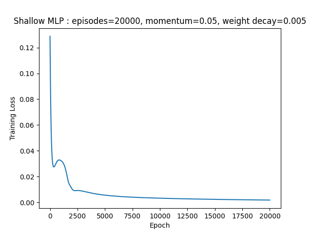
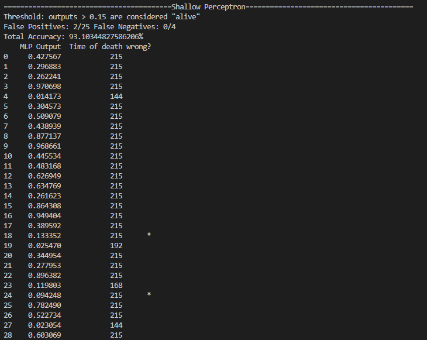
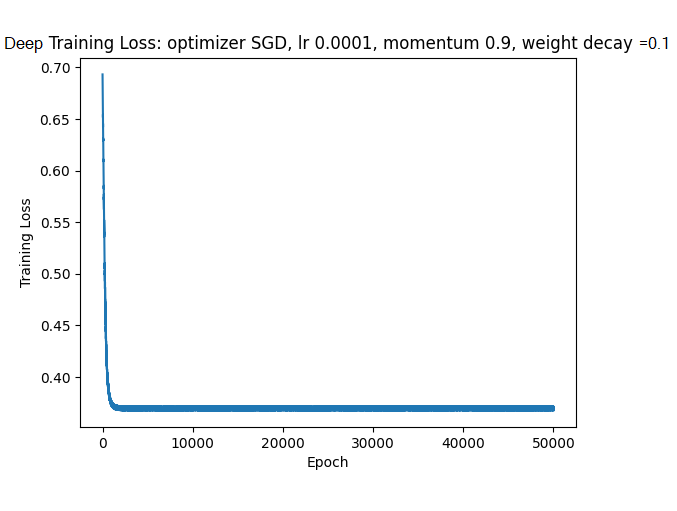
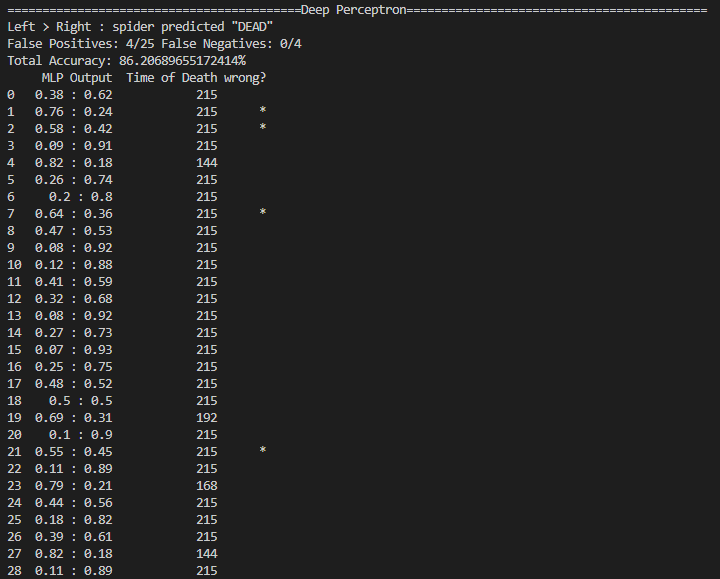

# How Can We Tell if a Spider Has Died?

@ Author [Jack Bosco](https://GitHub.com/JackBosco)

### See the idea pitch for a basic outline to the problem. 

### What I have are three .csv files where spider activity is tallied at each minute (row). The time of individual spider deaths was provided by combined decision of two circadian experts. I can use that to __train__ the models.

### I will to try two different approaches here:

1. A simple multilayered perceptron (MLP) with nothing but NumPy

2. A more complicated and powerful MLP model with PyTorch

The first approach involves implementing a machine learning algorithm called the perceptron learning algorithm line by line using a module called NumPy. The algorithm outputs a data file in binary representing a model for the spider circadian activity data. This model takes in a column of spider circadian activity data and outputs a number between 0.0 and 1.0 represent the *confidence* that a spider is still alive. 

Similar to the first approach, the second approach will train another model to create another binary data file. This approach, however, takes advantage of a more advanced *deep* perception learning algorithm to train a more sophisticated model for the spider circadian activity data. Moreover, this approach utilizes the PyTorch machine learning framework 
as opposed to a line by line implementation of the perceptron learning algorithm. Using PyTorch will allow for training the model using GPU hardware, if available, which may make the training go faster. The output of the model is two numbers representing the *probability* of a spider being alive or dead given the spider circadian activity data fed into it.

### To make the data learnable, however, I need to parse and __compress__ it.

This is because the amount of information for each spider is very complex. The greater the complexity, the more expensive it will be for the program to learn input/output patterns and train a model. Using some pre-computation, this complexity may greatly be reduced thus driving down the cost of training.

* First, define a *target* output for each spider by saving the row where it died
  * this is what makes the data useable for training the models
* Then pad all empty rows with 0s so the training data *looks like* the testing data
* Lastly, the dataset might be too large to train without using something like Amazon Web Services
  * I can crunch the thousands of rows in the files to a few hundred to make the input and output spaces less complex
    * This means converting minutes to hours or even days
  * I then flatten the data to 0s and 1s (0 for no activity, 1 for more than no activity) in each interval, again for complexity

-----

## Using a simple MLP Classifier

It took 20000 epochs to train this simple classifier. That may sound like a lot, but training it took less than a minute because the model is *shallow*. Shallow as in it only has five hidden units. When the loss starts to asymptote this means we have a working training algorithm.

I managed to get ~93% accuracy with this sigmoidal, shallow algorithm. These results are much higher than expected. 
The difference between this AI model's results and the __deep__ model is likely due to pure luck. 
Since every parameter in the model is originially set to a random value, there is some chance that you just get lucky. 

* mlpShallow_test.py
* mlpShallow_train.py

### Steps to recreate experiment for MLP Classifier:

1. cd to the Spider Mortality Estimation model repository and type `pip install -r requirements.txt`

2. train the model with the command `python3 mlpShallow_train.py`. Training chart will generate in `modules/saves/shallowe.png`

3. test the model with the command `python3 mlpShallow_test.py`. Testing table will be printed to the terminal.

----

## Using a DEEP MLP Classifier

Training this model took a lot more time. That is expected; the whole point of using this model is to utilize more 'hidden' parameters. The more parameters to tune, the more repitions it takes to train the model.

So, how did this extra time pay off? Not great. Overall, the result of 86% accuracy is not terrible; however, I was hoping to do better than the shallow model. 

* mlp_test.py
* mlp_train.py

### Steps to recreate experiment for Deep MLP Classifier:

1. cd to the Spider Mortality Estimation model repository and type `pip install -r requirements.txt`

2. train the model with the command `python3 mlp_train.py`. Training chart will generate in `precomp/deepsave/learning.png`

3. test the model with the command `python3 mlp_test.py`. Testing table will be printed to the terminal.

---

### A note on using external data

The shape of the model *must* mach with the size of the patterns being fed into it, meaning each .csv file used as testing or training data must have exactly 12960 rows or else it will cause the program to crash.
